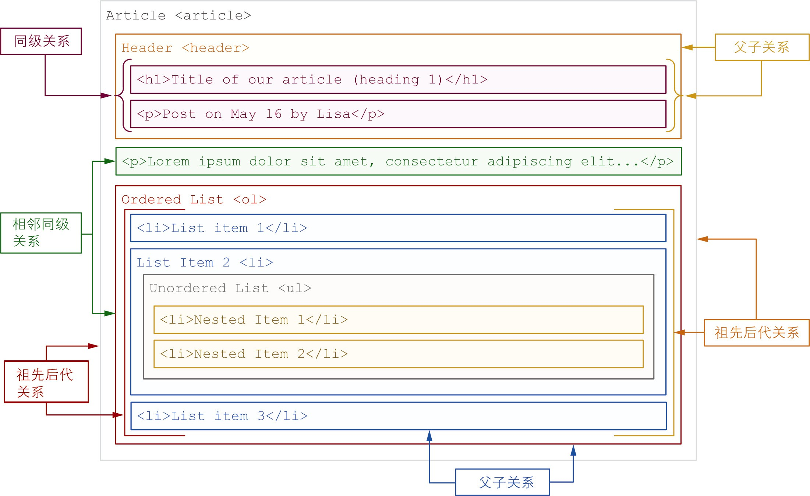
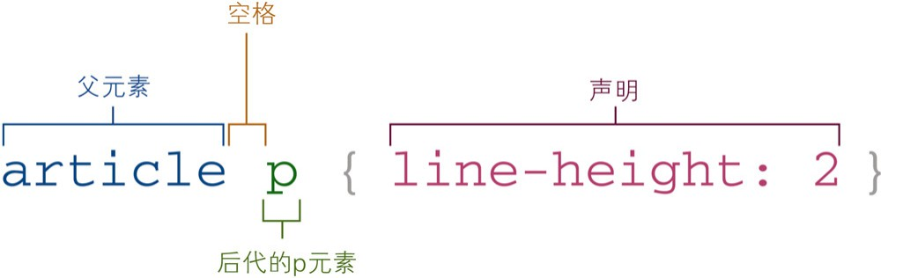

# 2. 组合选择器

- 后代元素组合器(` `)
- 子元素组合器(`>`)
- 相邻同级元素组合器(`+`)
- 一般同级元素组合器(`~`)



## a. 后代元素组合器



```css
article p {
    line-height: 2;
}
```

## b. 子元素组合器

- 子元素选择器和后代元素选择器的不同:
    - 子元素选择器只能选择直接子元素
    - 后代元素选择器可以选择所有后代元素

```html
<ul class="list">
    <li>
        List item 1
        <ul>
            <li>Nested item 1</li>
            <li>Nested item 2</li>
        </ul>
    </li>
    <li>List item 2</li>
    <li>List item 3</li>
    <li>List item 4</li>
</ul>
```

```css
.list > li {
    color: crimson;
}
```

- 此时`li`中的`ul`中的`li`不会被选中,但是由于继承的缘故,所以作为`.list`的孙子元素的`ul`中的`li`也变成深红色了
- 为仅选择一级元素(直接子元素),还需要再添加如下规则:

```css
.list > li ul {
    color: initial;
}
```

- 注: `>`是子元素选择器,但这不表示`<`就是父元素选择器
    - 想选择一个元素的父元素,需要使用`has()`伪类选择器

## c. 相邻同级元素组合器

- 用于选择紧跟在指定元素之后的同级元素
    - 相邻同级元素组合器只会选择紧接在指定元素**之后的第1个同级**元素
    - 重点:
        - 之后
        - 第1个
        - 同级

```css
header + p {
    font-size: 1.25rem;
    font-weight: bold;
}
```

```html
<!-- 不会选中这个 因为这个p在header之前 -->
<p>
  Lorem ...
</p>

<header>
    ...
</header>

<p>
  Lorem ...
</p>
```

- 使用场景:
    - 让页面中的第1个元素区别于其他元素以引起注意时使用
    - 表单的控件中发现无效值时,使用相邻同级元素组合器来选择错误提示文本的元素

## d. 一般同级元素组合器

- 用于选择出现在指定元素之后的所有同级元素
    - 与相邻同级元素组合器的区别:
        - 一般同级元素组合器会选择出现在指定元素之后的**所有**同级元素
        - 相邻同级元素组合器只会选择紧接在指定元素之后的**第1个**同级元素

```css
header ~ img {
    border: 4px solid crimson;
}
```