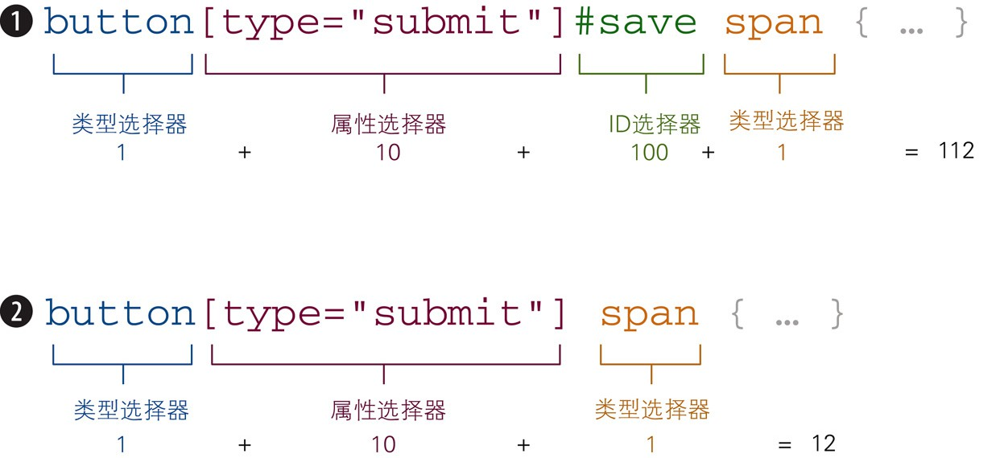
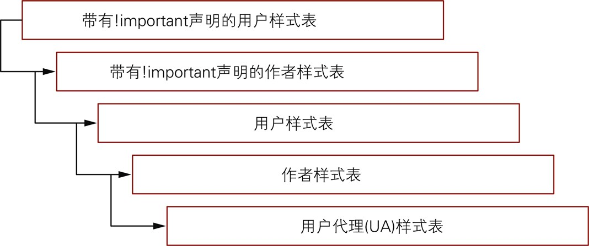

# 第1章 CSS介绍

## 1.4 CSS中的层叠

- 用户代理样式表: UA样式,即浏览器默认样式
- 作者样式表: 开发者自己编写的样式
- 用户样式表: 用户自己编写的样式(用于覆盖作者样式表)

### 1.4.4 CSS重置

- [CSS重置](https://meyerweb.com/eric/tools/css/reset/)
- 功能: 清除浏览器默认样式(UA样式)

### 1.4.5 CSS标准化器

- [CSS标准化器](https://github.com/necolas/normalize.css)
  - 功能: 使浏览器渲染的样式更一致,解决浏览器之间的差异 
  - 把该项目中的`normalize.css`文件中的样式复制到自己的项目中即可使用

### 1.4.6 `!important`注释

- 该注释最初的作用是帮助用户定义自己的样式,而非在开发时使用
- `!important`注释破坏了CSS的自然层叠,因此被认为是不良实践

## 1.5 CSS中的特异性

- 与主题相关的样式(颜色/字号)通常会被传递给子元素
- 与布局相关的样式通常不会传递给子元素

- 计算特异性值:

- 100: ID选择器
- 10: 类选择器/属性选择器/伪类选择器
- 1: 类型选择器/伪元素选择器
- 0: 通用选择器

- 带有`!important`注释的CSS优先级顺序:

