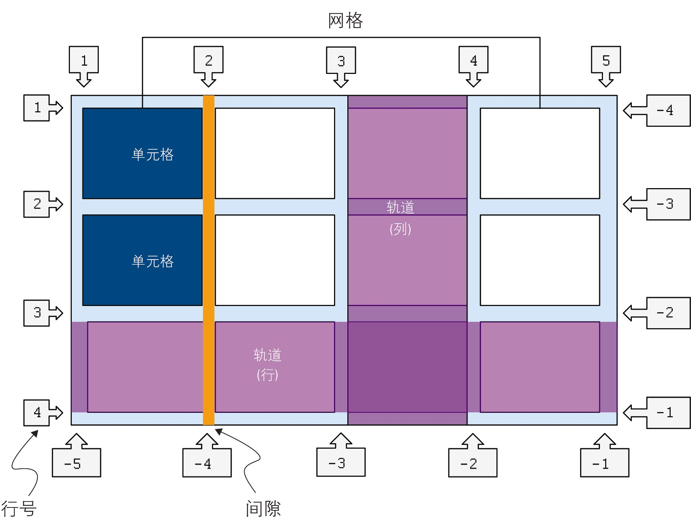

# 0. 概述



- 网格线: 即图中标注的数字.这些线在水平和垂直方向上运行,从左上角开始编号(从`1`开始),与正数相对的一侧为负数
  - 注: 线的编号取决于文本的书写方式(水平排列/垂直排列)和组件的文本方向
  - 例: 文本以英文书写,则最左边第1行为`1`,最右边第1行为`-1`(因为英文是从左到右书写的)
  - 例: 文本以阿拉伯文书写,则最左边第1行为`-1`,最右边第1行为`1`(因为阿拉伯文是从右到左书写的)

- 网格轨道: 网格中的行和列,严格意义讲,即网格上任意两条线之间的空间
  - 注意: 这里图中写的`轨道(列)`的位置其实有一点误导,应该写在单元格里

```css
main {
    display: grid;
    grid-template-columns: repeat(2, minmax(auto, 1fr)) 250px;
}
```

- `grid-template-columns`: 定义网格的列
  - `repeat(2, minmax(auto, 1fr))`: 重复2次,每次的宽度为`minmax(auto, 1fr)`
    - `minmax(auto, 1fr)`: 最小宽度为`auto`,最大宽度为`1fr`
      - `auto`: 自动宽度,即内容撑开的宽度
      - `1fr`: 占据剩余空间的1份
  - `250px`: 第3列的宽度为`250px`