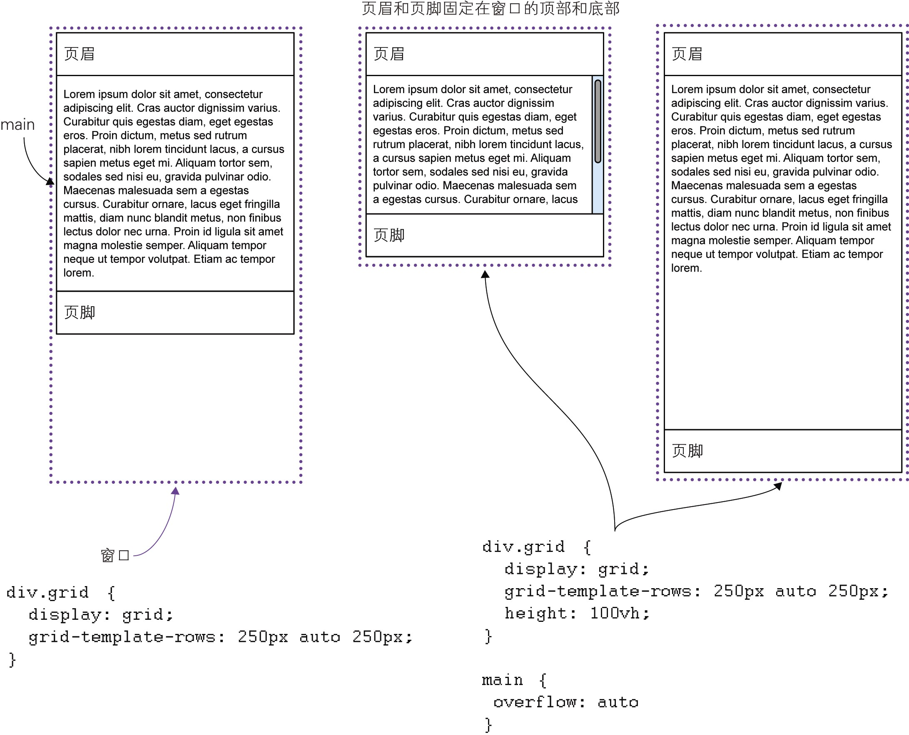

# 3. auto关键词

- 当`auto`关键词用作最大值时,其效果与`max-content`相同,即元素的内容决定了元素的大小
  - 注: [`max-content`的说明](https://developer.mozilla.org/zh-CN/docs/Web/CSS/max-content)

- `auto`通常还用在`overflow`属性中,表示内容溢出时的处理方式

