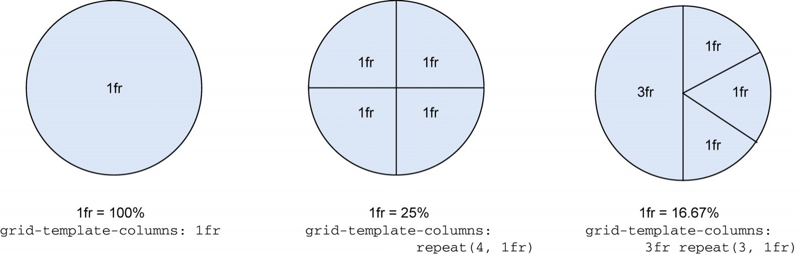

# 4. 分数(`fr`)单位

- `fr`: 是网格布局独有的单位,表示**可分配空间的份额**(fraction)
- 用于定义轨道(行/列)时,表示分配多少比例的可用空间
  - `fr`是一个相对单位,`1fr = 可用空间 / fr的总数`

- 浏览器默认假设开发者希望将HTML元素放置在每个网格单元格内(每个单元格1个元素)
- 浏览器不会自动垂直堆叠元素,而是按列填充,用完该列就再创建新的行
- 自动创建的额外网格单元格被称为隐式网格
