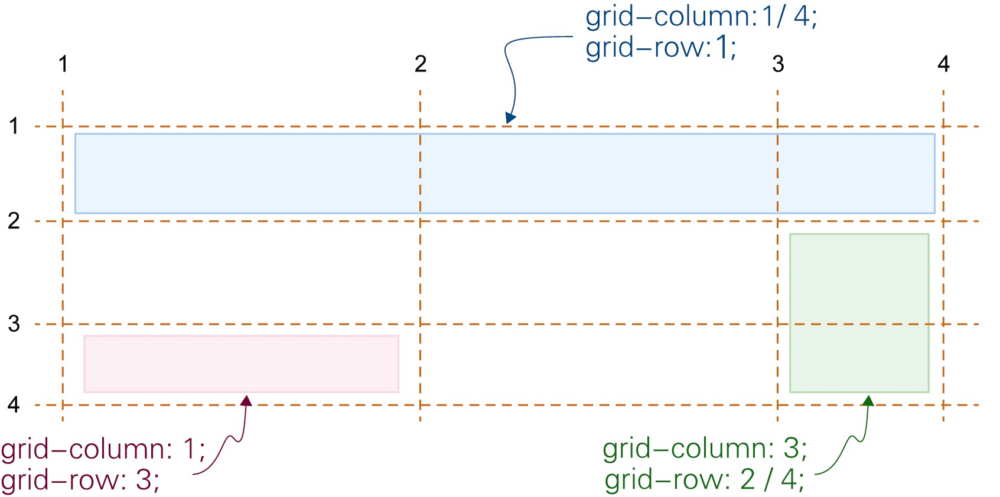
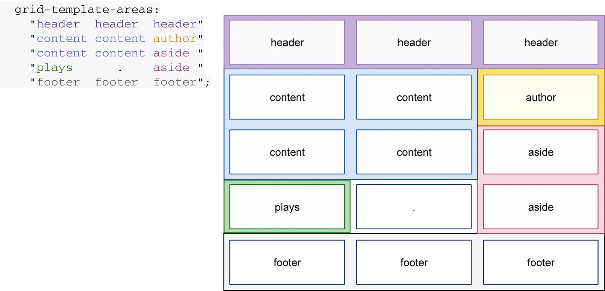

# 0. 概述

- 若想在网格的特定行和列上确定一个元素的位置,有2种方式:

## a. 使用网格线编号来指定子元素位置



- 例: `grid-column: 1 / 4`
- 这种方式其实有点像表格里的合并单元格,可以让一个元素跨越多个网格线

## b. 使用网格区域名称来指定子元素位置

- `grid-template-areas`属性可以定义网格区域名称,然后在子元素上使用`grid-area`属性来指定该元素所在的网格区域
  - 这种方式比`grid-column`和`grid-row`更直观,可以通过名称来理解布局
- `grid-template-areas`属性的值为多个字符串,每个字符串代表一行,字符串中的单词代表网格区域名称
  - 若2个相邻的单元格具有相同的名称,则这2个单元格被视为1个区域
  - 1个区域可以只有1个单元格,也可以跨越多个单元格
  - 但如果1个区域跨越了多个单元格,则这些单元格必须组成一个矩形,且要求其中所有相同名称的单元格必须是相邻的
  - 例: 你不能创建一个L形区域



```css
main {
    display: grid;
    grid-template-columns: repeat(2, minmax(auto, 1fr)) 250px;
    grid-template-areas:
        "header header header"
        "content content author"
        "content content aside"
        "plays . aside"
        "footer footer footer";
}
```

- `.`表示空白区域,用于占位,无法向该区域分配内容(元素)
