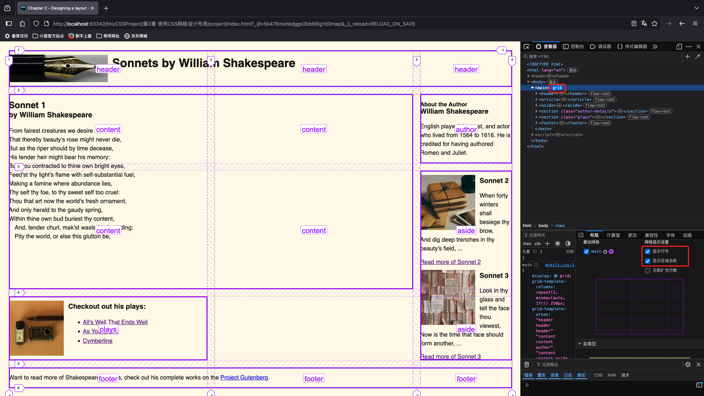

# 1. `grid-area`属性

- 用途: 分配网格区域.该属性的值就是在`grid-template-areas`属性中定义的区域名称

```css
header {
    grid-area: header;
}

article {
    grid-area: content;
}

aside {
    grid-area: aside;
}

.author-details {
    grid-area: author;
}

.plays {
    grid-area: plays;
}

footer {
    grid-area: footer;
}
```



.png)
